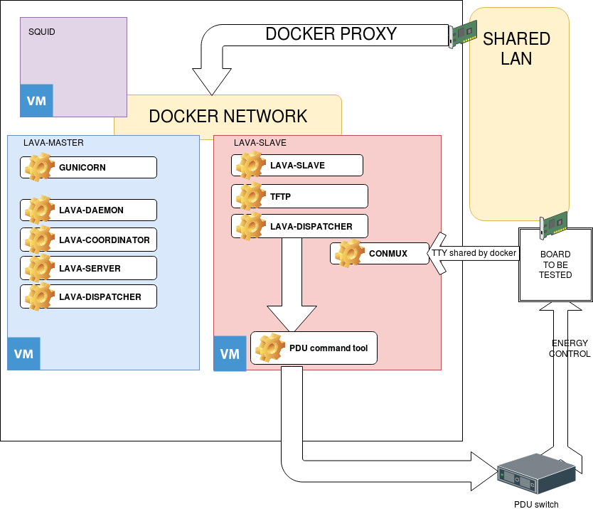

# Linaro's Automated Validation Architecture (LAVA) Docker Container

## Introduction

The goal of lava-docker is to simplify the install and maintenance of
a LAVA lab in order to participate in distributed test efforts such as
kernelCI.org.

With lava-docker, you describe the devices under test (DUT) in a
simple YAML file, and then a custom script will generate the necessary
LAVA configuration files automatically.

Similarly, LAVA users and authentication tokens are described in
a(nother) YAML file, and the LAVA configurations are automatically generated.

This enables the setup of a LAVA lab with minimal knowledge of the
underlying LAVA configuration steps necessary.

## Prerequisites
lava-docker has currently been tested primarily on Debian stable (stretch).
The following packages are necessary on the host machine:
* docker
* docker-compose

## Quickstart
Example to use lava-docker with only one QEMU device:

* Checkout the lava-docker repository
* Generate configuration files for LAVA, udev, serial ports, etc. from boards.yaml via
```
./lavalab-gen.py
```
* Go to output/local directory
* Build docker images via
```
docker-compose build
```
* Start all images via
```
docker-compose up -d
```

* Once launched, you can access the LAVA web interface via http://localhost:10080/.
With the default users, you can login with admin:admin.

* By default, a LAVA healthcheck job will be run on the qemu device.
You will see it in the "All Jobs" list: http://localhost:10080/scheduler/alljobs

* You can also see full job output by clicking the blue eye icon ("View job details") (or via http://localhost:10080/scheduler/job/1 since it is the first job ran)

* For more details, see https://validation.linaro.org/static/docs/v2/first-job.html

### Adding your first board:
#### device-type
To add a board you need to find its device-type, standard naming is to use the same as the official kernel DT name.
(But a very few DUT differ from that)

You could check in https://github.com/Linaro/lava-server/tree/release/lava_scheduler_app/tests/device-types if you find yours.

Example:
For a beagleboneblack, the device-type is beaglebone-black (Even if official DT name is am335x-boneblack)
So you need to add in the boards section:
```
    - name: beagleboneblack-01
      type: beaglebone-black
```

#### UART
Next step is to gather information on UART wired on DUT.<br>
If you have a FTDI, simply get its serial (visible in lsusb -v or for major distribution in dmesg)<br>
<br>
For other UART type (or for old FTDI without serial number) you need to get the devpath attribute via:
```
udevadm info -a -n /dev/ttyUSBx |grep ATTR|grep devpath | head -n1
```
Example with a FTDI UART:
```
[    6.616707] usb 4-1.4.2: New USB device strings: Mfr=1, Product=2, SerialNumber=3
[    6.704305] usb 4-1.4.2: SerialNumber: AK04TU1X
The serial is AK04TU1X
```
So you have now:
```
    - name: beagleboneblack-01
      type: beaglebone-black
      uart:
        idvendor: 0x0403
	idproduct: 0x6001
	serial: AK04TU1X
```

Example with a FTDI without serial:
```
[2428401.256860] ftdi_sio 1-1.4:1.0: FTDI USB Serial Device converter detected
[2428401.256916] usb 1-1.4: Detected FT232BM
[2428401.257752] usb 1-1.4: FTDI USB Serial Device converter now attached to ttyUSB1
udevadm info -a -n /dev/ttyUSB1 |grep devpath | head -n1
    ATTRS{devpath}=="1.5"
```
So you have now:
```
    - name: beagleboneblack-01
      type: beaglebone-black
      uart:
        idvendor: 0x0403
	idproduct: 0x6001
	devpath: "1.5"
```

#### PDU (Power Distribution Unit)
Final step is to manage the powering of the board.<br>
Many PDU switchs could be handled by a command line tool which control the PDU.<br>
You need to fill boards.yaml with the command line to be ran.<br>

Example with an ACME board:
If the beagleboneblack is wired to port 3 and the ACME board have IP 192.168.66.2:
```
      pdu_generic:
        hard_reset_command: /usr/local/bin/acme-cli -s 192.168.66.2 reset 3
        power_off_command: /usr/local/bin/acme-cli -s 192.168.66.2 power_off 3
        power_on_command: /usr/local/bin/acme-cli -s 192.168.66.2 power_on 3
```

#### Example:
beagleboneblack, with FTDI (serial 1234567), connected to port 5 of an ACME
```
    - name: beagleboneblack-01
      type: beaglebone-black
      pdu_generic:
        hard_reset_command: /usr/local/bin/acme-cli -s 192.168.66.2 reset 5
        power_off_command: /usr/local/bin/acme-cli -s 192.168.66.2 power_off 5
        power_on_command: /usr/local/bin/acme-cli -s 192.168.66.2 power_on 5
      uart:
        idvendor: 0x0403
	idproduct: 0x6001
	serial: 1234567
```

## Architecture
The basic setup is composed of a host which runs the following docker images and DUT to be tested.<br/>
* lava-master: run lava-server along with the web interface
* lava-slave: run lava-dispatcher, the compoment which sends jobs to DUTs
* squid: an HTTP proxy for caching downloaded contents (kernel/dtb/rootfs) (Work in progress)

The host and DUTs must share a common LAN.<br/>
The host IP on this LAN must be set as dispatcher_ip in boards.yaml.<br/>

Since most DUTs are booted using TFTP, they need DHCP for gaining network connectivity.<br/>
So, on the LAN shared with DUTs, a running DHCPD is necessary. (See DHCPD below)<br/>



## Multi-host architectures
Lava-docker support multi-host architecture, Master and slaves could be on different host.

Lava-docker support multiples slaves, but with a maximum of one slave per host.
This is due to that slave need TFTP port accessible from outside.

### Power supply
You need to have a PDU for powering your DUT.
Managing PDUs is done via pdu_generic

### Network ports
The following ports are used by lava-docker and are proxyfied on the host:
- 69/UDP	proxyfied to the slave for TFTP
- 80		proxyfied to the slave for TODO (transfer overlay)
- 5500		proxyfied to the slave for Notification
- 5555		proxyfied to the master (LAVA logger)
- 5556		proxyfied to the master (LAVA master)
- 10080		proxyfied to the master (Web interface)
- 55950-56000	proxyfied to the slave for NBD

### DHCPD
A DHCPD service is necessary for giving network access to DUT.

The DHCPD server could be anywhere with the condition that it is accessible of DUTs. (Could be on host, in a docker in the host, or is the ISP box on the same LAN.<br/>

### Examples
#### Example 1: Basic LAB with home router
Router: 192.168.1.1 which handle DHCP for 192.168.1.10-192.168.1.254<br>
Lab: 192.168.1.2<br>

So the dispatcher_ip is set to 192.168.1.2

#### Example 2: Basic LAB without home router
Lab: 192.168.1.2 which handle DHCP for 192.168.1.10-192.168.1.254<br>

So the dispatcher_ip is set to 192.168.1.2

#### Example 3: LAB with dedicated LAN for DUTs
A dedicated LAN is used for DUTs. (192.168.66.0/24)
The host have two NIC:
- eth0: (192.168.1.0/24) on home LAN. (The address could be static or via DHCP)
- eth1: (192.168.66.0/24) with address set to 192.168.66.1

On the host, a DHCPD give address in range of 192.168.66.3-192.168.66.200

So the dispatcher_ip is set to 192.168.66.1

#### DHCPD examples:
##### isc-dhcpd-server
A sample isc-dhcpd-server DHCPD config file is available in the dhcpd directory.<br/>
##### dnsmasq
Simply set interface=interfacename where interfacename is your shared LAN interface

## Generating files

### Helper script
You can use the lavalab-gen.sh helper script which will do all the above actions for you.

### boards.yaml
This file describe how the DUTs are connected and powered.
```
masters:
 - name:  lava-master	name of the master
    host: name		name of the host running lava-master (default to "local")
    webadmin_https:	Does the LAVA webadmin is accessed via https
    zmq_auth: True/False	Does the master requires ZMQ authentication.
    zmq_auth_key:		optional path to a public ZMQ key
    zmq_auth_key_secret:	optional path to a private ZMQ key
    persistent_db: True/False	(default False) Is the postgres DB is persistent over reboot
    http_fqdn:			The FQDN used to access the LAVA web interface
    users:
    - name: LAVA username
      token: The token of this user 	(optional)
      password: Password the this user (generated if not provided)
      email:	email of the user	(optional)
      superuser: yes/no (default no)
      staff: yes/no (default no)
    tokens:
    - username: The LAVA user owning the token below. (This user should be created via users:)
      token: The token for this callback
      description: The description of this token. This string could be used with LAVA-CI.
slaves:
  - name: lab-slave-XX		The name of the slave (where XX is a number)
    host: name			name of the host running lava-slave-XX (default to "local")
    zmq_auth_key:		optional path to a public ZMQ key
    zmq_auth_key_secret:	optional path to a private ZMQ key
    dispatcher_ip: 		the IP where the slave could be contacted. In lava-docker it is the host IP since docker proxify TFTP from host to the slave.
    remote_master: 		the name of the master to connect to
    remote_address: 		the FQDN or IP address of the master (if different from remote_master)
    remote_rpc_port: 		the port used by the LAVA RPC2 (default 80)
    remote_user: 		the user used for connecting to the master
    remote_proto:		http(default) or https
    extra_actions:		An optional list of action to do at end of the docker build
    - "apt-get install package"

boards:
  - name: devicename	Each board must be named by their device-type as "device-type-XX" (where XX is a number)
    type: the LAVA device-type of this device
    kvm: (For qemu only) Does the qemu could use KVM (default: no)
    uboot_ipaddr:	(optional) a static IP to set in uboot
    uboot_macaddr:	(Optional) the MAC address to set in uboot
    custom_option:	(optional) All following strings will be directly append to devicefile
    - "set x=1"
# One of uart or connection_command must be choosen
    uart:
      idvendor: The VID of the UART (Formated as 0xXXXX)
      idproduct: the PID of the UART (Formated as 0xXXXX)
      serial: The serial number in case of FTDI uart
      devpath: the UDEV devpath to this uart for UART without serial number
      use_ser2net: True/false (Use ser2net instead of conmux-console)
      use_screen: True/false (Use screen via ssh instead of conmux-console)
    connection_command: A command to be ran for getting a serial console
    pdu_generic:
      hard_reset_command: commandline to reset the board
      power_off_command: commandline to power off the board
      power_on_command: commandline to power on the board
```
Notes on UART:
* Only one of devpath/serial is necessary.
* For finding the right devpath, you could use
```
udevadm info -a -n /dev/ttyUSBx |grep devpath | head -n1
```
* VID and PID could be found in lsusb. If a leading zero is present, the value must be given between double-quotes (and leading zero must be kept)
Example:
```
Bus 001 Device 054: ID 0403:6001 Future Technology Devices International, Ltd FT232 Serial (UART) IC
```
This device must use "0403" for idvendor and 6001 for idproduct.

Note on connection_command: connection_command is for people which want to use other way than conmux to handle the console. (ser2net).

Examples: see [boards.yaml.example](boards.yaml.example)

### Generate
```
lavalab-gen.py
```

this script will generate all necessary files in the following locations:
```
output/host/lava-master/tokens/			This is where the callback tokens will be generated
output/host/lava-master/users/			This is where the users will be generated
output/host/lab-slave-XX/conmux/		All files needed by conmux
output/host/lab-slave-XX/devices/		All LAVA devices files
output/host/udev/99-lavaworker-udev.rules 	udev rules for host
output/host/docker-compose.yml			Generated from docker-compose.template
```

All thoses file (except for udev-rules) will be handled by docker.

You can still hack after all generated files.

#### udev rules
Note that the udev-rules are generated for the host, they must be placed in /etc/udev/rules.d/
They are used for giving a proper /dev/xxx name to tty devices. (where xxx is the board name)
(lavalab-gen.sh will do it for you)

### Building
To build all docker images, execute the following from the directory you cloned the repo:

```
docker-compose build
```

### Running
For running all images, simply run:
```
docker-compose up -d
```

## Proxy cache (Work in progress)
A squid docker is provided for caching all LAVA downloads (image, dtb, rootfs, etc...)<br/>
You have to uncomment a line in lava-master/Dockerfile to enable it.<br/>
For the moment, it is unsupported and unbuilded.

## Backporting LAVA patches
All upstream LAVA patches could be backported by placing them in lava-master/lava-patch/

## Backups / restore
For backupping a running docker, the "backup.sh" script could be used.
It will store boards.yaml + postgresql database backup + joboutputs.

For restoring a backup, postgresql database backup + joboutputs must be copied in master backup directory before build.

Example:
./backup.sh
This produce a backup-20180704_1206 directory
For restoring this backup, simply cp backup-20180704_1206/* output/local/master/backup/

## Upgrading from a previous lava-docker
For upgrading between two LAVA version, the only method is:
- backup data with ./backup.sh (See Backups / restore)
- checkout the new lava-docker and a your boards.yaml
- run lavalab-gen.py
- copy your backup data in output/yourhost/master/backup directory
- build and run docker-compose

## Security
Note that this container provides defaults which are unsecure. If you plan on deploying this in a production enviroment please consider the following items:

  * Changing the default admin password (in tokens.taml)
  * Using HTTPS
  * Re-enable CSRF cookie (disabled in lava-master/Dockerfile)
